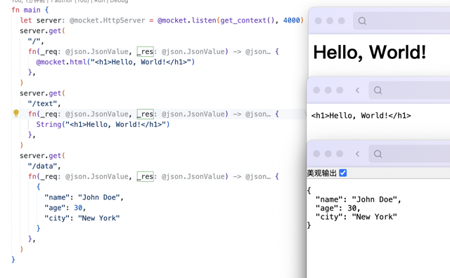

# oboard/mocket

A web framework for MoonBit.




## Usage

Minimum Example: https://github.com/oboard/mocket_example

## Async Support

The library now supports async/await for I/O operations:

- `readFile`: Asynchronously read files
- `readDir`: Asynchronously read directories
- `exec`: Asynchronously execute commands
- `fetch`: Asynchronously make HTTP requests

Async functions can be called using the `!!` operator and must be wrapped in
`run_async` when called from synchronous contexts.

### Async /GET Example

```moonbit
// async json data example
server.get("/async_data", async fn(
  _req : @mocket.HttpRequest,
  _res : @mocket.HttpResponse
) {
  { "name": "John Doe", "age": 30, "city": "New York" }
})
```

```moonbit
run_async(fn() {
  try {
    let result = @mocket.exec!!("ls")
    println(result)
  } catch {
    err => println("Error executing command: \{err}")
  }
})
run_async(fn() {
  try {
    let response = @mocket.fetch!!("https://api64.ipify.org/")
    println(response)
  } catch {
    err => println("Error fetching data: \{err}")
  }
})
```

## Error Handling

Async operations return `Result` types or use the `!` error type syntax:

- `readFile`: Returns `Bytes!Error`
- `exec`: Returns `String!Error`
- `fetch`: Returns `FetchResponse!NetworkError`

Use `try/catch` blocks to handle potential errors.

### MocketGo Runtime (Experimental)

Download the latest release from: https://github.com/oboard/mocketgo/releases

#### Linux/MacOS:

```bash
chmod +x ./mocketgo
./mocketgo main.wasm
```

#### Windows:

```bat
mocketgo.exe main.wasm
```

### Node.js Runtime

#### Prerequisites

- MoonBit SDK installed
- Node.js installed

#### Linux/MacOS:

```bash
sudo chmod +x ./start.sh
./start.sh
```

OR run with make:

```bash
make serve
```

### Windows:

```bat
start.bat
```

## Example usage

```moonbit
// Example usage of mocket package in MoonBit

fn main {
  let port = 4000
  let server = @mocket.listen(get_context(), port)
  // readFile example
  // @mocket.readFile("./logo.jpg").finally(
  //   fn(data : Bytes) { println(data.length()) },
  // )
  // html response example
  server.get(
    "/",
    fn(_req : @mocket.HttpRequest, _res : @mocket.HttpResponse) {
      @mocket.html("<h1>Hello, World!</h1>")
    },
  )
  // string response example
  server.get(
    "/text",
    fn(_req : @mocket.HttpRequest, _res : @mocket.HttpResponse) {
      String("<h1>Hello, World!</h1>")
    },
  )
  // json data example
  server.get(
    "/data",
    fn(_req : @mocket.HttpRequest, _res : @mocket.HttpResponse) {
      { "name": "John Doe", "age": 30, "city": "New York" }
    },
  )
  // echo server example
  server.post(
    "/echo",
    fn(req : @mocket.HttpRequest, _res : @mocket.HttpResponse) {
      match req.body {
        Some(data) => data
        _ => String("No data received")
      }
    },
  )
  // file serving example
  server.get(
    "/image",
    fn(_req : @mocket.HttpRequest, _res : @mocket.HttpResponse) {
      @mocket.file("logo.jpg")
    },
  )

  // buffer serving example
  server.get(
    "/buffer",
    fn(_req : @mocket.HttpRequest, _res : @mocket.HttpResponse) {
      @mocket.buffer(
        [
          72, 101, 108, 108, 111, 32, 87, 111, 114, 108, 100, 33, 32, 84, 104, 105,
          115, 32, 105, 115, 32, 97, 32, 116, 101, 115, 116, 32, 115, 116, 114, 105,
          110, 103, 32, 102, 111, 114, 32, 116, 101, 115, 116, 105, 110, 103, 32,
          112, 117, 114, 112, 111, 115, 101,
        ].map(fn(x) { x.to_byte() })
        |> Bytes::from_array,
      )
    },
  )

  // static file serving example
  // Example: http://localhost:4000/static/logo.jpg => ./logo.jpg
  server.static("/static/", "./")
}
```
